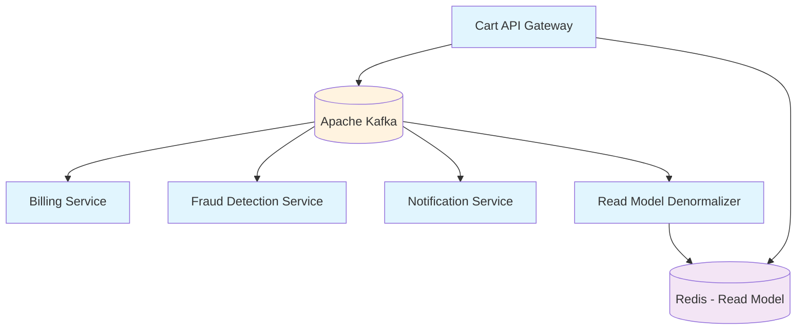

# 🛒 Shopping Cart Microservices


A distributed, event-driven shopping cart system built with .NET 9 using CQRS, Event Sourcing, and Microservices Architecture.

## ✨ Features

- **Event-Driven Architecture** - Powered by Apache Kafka
- **CQRS Pattern** - Separate read/write models
- **Event Sourcing** - Full history of all cart changes
- **Dockerized** - Easy deployment & scaling
- **Real-time Updates** - Via Redis-based read model
- **Fraud Detection** - Real-time prevention system
- **Payment Processing** - Asynchronous billing handling
- **Notifications** - Email & SMS support
- **Monitoring** - OpenTelemetry, Prometheus, and Grafana integration

## 🏗️ System Architecture



## 📦 Services

| Service | Description | Port |
|---------|-------------|------|
| **Cart.API** | Main gateway & cart handling | 5105 |
| **Billing.Service** | Billing & payment processing | 5201 |
| **Fraud.Service** | Fraud detection & prevention | 5202 |
| **Notification.Service** | Email & SMS notifications | 5203 |
| **Cart.Denormalizer** | Read model projection | 5204 |

## 📁 Project Structure

```
proj/
├── src/
│   ├── Cart.API/                 # Main API gateway
│   ├── Cart.Domain/              # Shared domain models
│   ├── Billing.Service/          # Payment processing
│   ├── Fraud.Service/            # Fraud detection
│   ├── Notification.Service/     # Notifications
│   ├── Cart.Denormalizer/        # Read model denormalizer
│   └── Shared.Kernel/            # Shared infrastructure
└── infra/
    ├── docker-compose.yml        # Docker setup
    └── monitoring configs        # OTEL, Prometheus, Grafana
```

## 🚀 Getting Started

### Prerequisites

- [.NET 9 SDK](https://dotnet.microsoft.com/download/dotnet/9.0)
- [Docker & Docker Compose](https://docs.docker.com/get-docker/)

### Installation

1. **Clone and setup**:
```bash
git clone <repository-url>
cd shopping-cart-microservices
```

2. **Start infrastructure**:
```bash
docker-compose -f infra/docker-compose.yml up -d
```

3. **Build and run**:
```bash
dotnet restore
dotnet build
dotnet run --project src/ShoppingCart.sln
```

## ⚙️ Configuration

### Environment Variables

Create `.env` file or set these variables:

```bash
KAFKA_BOOTSTRAP_SERVERS=localhost:9092
REDIS_CONNECTION_STRING=localhost:6379
POSTGRES_CONNECTION_STRING=Host=localhost;Database=shoppingcart;Username=postgres;Password=password
ASPNETCORE_ENVIRONMENT=Development
```

### AppSettings

Each service has environment-specific configuration files:
- `appsettings.json` - Base configuration
- `appsettings.Development.json` - Development settings
- `appsettings.Docker.json` - Docker-specific settings

## 📡 API Usage

### Add Item to Cart
```http
POST /api/cart/{cartId}/items
Content-Type: application/json

{
    "userId": "user-123",
    "productId": "prod-456",
    "productName": "Gaming Laptop",
    "price": 25000000,
    "quantity": 1
}
```

### Remove Item from Cart
```http
DELETE /api/cart/{cartId}/items/{productId}
```

### Get Cart View
```http
GET /api/cart/view/{cartId}
```

### Example Request
```bash
curl -X POST "http://localhost:5105/api/cart/123e4567-e89b-12d3-a456-426614174000/items" \
  -H "Content-Type: application/json" \
  -d '{
    "userId": "user-123",
    "productId": "prod-456",
    "productName": "Gaming Laptop",
    "price": 25000000,
    "quantity": 1
  }'
```

## 🔧 Development

### Running Services Individually

```bash
# Cart API
dotnet run --project src/Cart.API/

# Billing Service
dotnet run --project src/Billing.Service/

# Fraud Service
dotnet run --project src/Fraud.Service/

# Notification Service
dotnet run --project src/Notification.Service/

# Denormalizer
dotnet run --project src/Cart.Denormalizer/
```

### Monitoring

Access monitoring tools:
- **Grafana**: http://localhost:3000
- **Prometheus**: http://localhost:9090
- **Kibana**: http://localhost:5601

## 🤝 Contributing

1. Fork the repository
2. Create a feature branch (`git checkout -b feature/amazing-feature`)
3. Commit changes (`git commit -m 'Add amazing feature'`)
4. Push to branch (`git push origin feature/amazing-feature`)
5. Open a Pull Request

### Development Guidelines

- Follow CQRS and Event Sourcing patterns
- Ensure events are properly serialized/deserialized
- Maintain OpenTelemetry instrumentation
- Include appropriate logging with Serilog

## 📄 License

This project is licensed under the MIT License - see the [LICENSE](LICENSE) file for details.

## 🐛 Troubleshooting

### Common Issues

1. **Kafka connection issues**:
   - Ensure Kafka and Zookeeper are running
   - Check `KAFKA_BOOTSTRAP_SERVERS` configuration

2. **Redis connection errors**:
   - Verify Redis container is running
   - Check connection string configuration

3. **OpenTelemetry export failures**:
   - Ensure OTEL collector is running
   - Check endpoint configuration

### Debugging

Enable debug logging by setting Serilog minimum level to "Debug" in appsettings:

```json
{
  "Serilog": {
    "MinimumLevel": {
      "Default": "Debug"
    }
  }
}
```

## 📊 Monitoring & Observability

The system includes comprehensive monitoring:

- **OpenTelemetry** tracing across all services
- **Prometheus** metrics collection
- **Grafana** dashboards for visualization
- **Elasticsearch** and **Kibana** for log aggregation

Check the `infra/` directory for monitoring configuration files.

## 🔮 Future Enhancements

- [ ] Authentication & Authorization
- [ ] Payment gateway integration
- [ ] Advanced fraud detection rules
- [ ] Email/SMS notification templates
- [ ] Load testing suite
- [ ] Additional monitoring dashboards

---

For questions and support, please open an issue in the GitHub repository.
