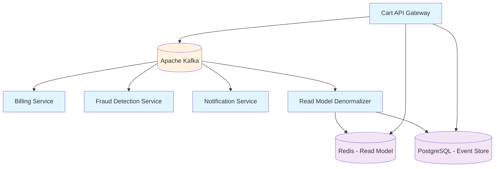

# 🛒 Shopping Cart Microservices


A distributed, event-driven **shopping cart system** built with **.NET 9** using **CQRS**, **Event Sourcing**, and **Microservices Architecture**.

---

## ✨ Key Features

- **🎯 Event-Driven Architecture** – powered by Apache Kafka  
- **📦 CQRS Pattern** – separate read/write models  
- **🔄 Event Sourcing** – full history of all changes  
- **🐳 Dockerized** – easy deployment & scaling  
- **📊 Real-time Updates** – via WebSocket  
- **🔍 Fraud Detection** – real-time prevention  
- **💳 Payment Integration** – asynchronous payment handling  
- **📱 Notifications** – Email & SMS support  
- **📈 Scalability** – horizontal scaling supported  
- **🔒 Security** – JWT authentication & authorization  

---

## 🏗️ System Architecture



---

## 📦 Microservices

| Service               | Description                   | Port |
|------------------------|-------------------------------|------|
| **Cart.API**           | Main gateway & cart handling | 5105 |
| **Billing.Service**    | Billing & payment processing | 5201 |
| **Fraud.Service**      | Fraud detection & prevention | 5202 |
| **Notification.Service** | Email & SMS notifications  | 5203 |
| **Cart.Denormalizer**  | Read model projection        | 5204 |

---

## 🚀 Getting Started

### Prerequisites

- [.NET 9 SDK](https://dotnet.microsoft.com/download/dotnet/9.0)  
- [Docker & Docker Compose](https://docs.docker.com/get-docker/)  
- [Git](https://git-scm.com/)  

### Development Setup

```bash
# Clone repository
git clone https://github.com/your-username/shopping-cart-microservices.git
cd shopping-cart-microservices

# Start infrastructure
docker-compose -f infra/docker-compose.yml up -d

# Build & run
dotnet restore
dotnet build
dotnet run --project src/ShoppingCart.sln
```

### Run Tests

```bash
# Unit tests
dotnet test tests/unit-tests/

# Integration tests
dotnet test tests/integration-tests/

# Load tests
k6 run tests/load-tests/cart-load-test.js
```

---

## 📡 API Endpoints

### Add Item to Cart
```http
POST /api/cart/{cartId}/items
```

### Remove Item from Cart
```http
DELETE /api/cart/{cartId}/items/{productId}
```

### Get Cart Events
```http
GET /api/cart/{cartId}/events
```

### Get Cart View
```http
GET /api/cart/view/{cartId}
```

Example request:
```bash
curl -X POST "http://localhost:5105/api/cart/123e4567-e89b-12d3-a456-426614174000/items"   -H "Content-Type: application/json"   -d '{
    "userId": "user-123",
    "productId": "prod-456",
    "productName": "Gaming Laptop",
    "price": 25000000,
    "quantity": 1
  }'
```

---

## 🛠️ Tech Stack

**Backend**: .NET 9, ASP.NET Core, EF Core, Npgsql  
**Messaging**: Apache Kafka, Confluent.Kafka  
**Databases**: PostgreSQL (event store), Redis (cache & read model)  
**Infrastructure**: Docker, Kubernetes, Terraform  
**Monitoring**: Prometheus, Grafana, Serilog, Elasticsearch  

---

## ⚙️ Configuration

### Environment Variables
```bash
KAFKA_BOOTSTRAP_SERVERS=localhost:9092
KAFKA_GROUP_ID=shopping-cart-group
REDIS_CONNECTION_STRING=localhost:6379
POSTGRES_CONNECTION_STRING=Host=localhost;Database=shoppingcart;Username=postgres;Password=password
ASPNETCORE_ENVIRONMENT=Development
```

---

## 📊 Performance Metrics

| Metric           | Value    | Description            |
|------------------|----------|------------------------|
| **Response Time**| <100 ms  | For read operations    |
| **Throughput**   | 10,000+  | Requests per second    |
| **Event Handling**| 50,000+ | Events per second      |
| **Latency**      | <50 ms   | Event processing time  |

---

## 🚀 Deployment

### With Docker
```bash
docker-compose -f infra/docker-compose.prod.yml build
docker-compose -f infra/docker-compose.prod.yml up -d
```

### With Kubernetes
```bash
kubectl apply -f infra/kubernetes/
kubectl get pods
kubectl get services
```

---
